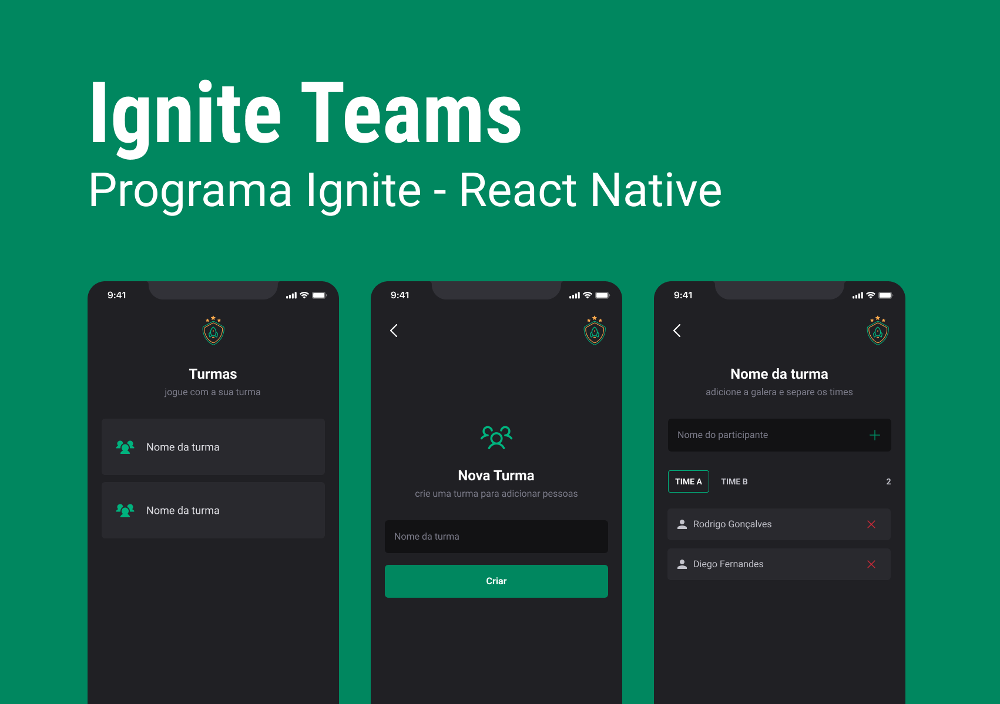

# Ignie Teams

<h1 align="center">
  
</h1>

> Projeto desenvolvido dentro do treinamento Ignite da Rocketseat. Todo o código foi desenvolvido em aula a prtir de prtótipo do [Figma](https://www.figma.com/file/BCNn7k8bu755VYjWXqm3bB/Ignite-Teams-(Community)?node-id=47%3A273&t=tJNm8FEE4PnK8nDK-0). A ideia do aplicativo é ser um gerenciador de turmas de jogadores, podendo gerenciar turmas e participantes.  
### 🚧 Ajustes e melhorias

O projeto ainda está em desenvolvimento e as próximas atualizações serão voltadas nas seguintes tarefas:

- [ ] Login social
- [ ] Gerenciamento global de dados utilizando a Context api 
- [ ] Salvamento de dados em backend
## 💻 Pré-requisitos

Antes de começar, verifique se você atendeu aos seguintes requisitos:
* Você tem uma máquina `<Windows / Linux / Mac>`.
* Você tem o [git](https://git-scm.com) instalado na sua máquina.
* Você tem o [node](https://nodejs.org/en/) instalado na sua máquina.
* Você tem algum `emulador` instalado na sua máquina ou `device físico` com o aplicativo `Expo Go` instalado.

## 🚀 Instalando Ignite Teams

Para instalar o Ignite Teams, siga estas etapas:

bash:
```
# Clone este repositório
$ git clone <https://github.com/caiohbfurtado/ignite-teams>
# Acesse a pasta do projeto no terminal/cmd
$ cd ignite-teams
# Instale as dependências
$ npm install ou yarn install
```

## ☕ Usando Ignite Teams

Para usar Ignite Teams, siga estas etapas:

bash:
```
# Acesse a pasta do projeto no terminal/cmd
$ cd ignite-teams
# Execute a aplicação em modo de desenvolvimento
$ expo start
# O servidor inciará na porta:19000
# Você poderá inicializar a aplicação pressionando a para Android, i para iOS ou lendo o QR Code com seu device físico
```

### 🛠 Tecnologias

As seguintes ferramentas foram usadas na construção do projeto:

- [Expo](https://expo.io/)
- [React Native](https://reactnative.dev/)
- [TypeScript](https://www.typescriptlang.org/)
- [Styled Components](https://styled-components.com/)
- [React Navigation](https://reactnavigation.org/)
- [Async Storage](https://react-native-async-storage.github.io/async-storage/docs/usage/)
- [date-fns](https://date-fns.org/)

### 👨🏾‍💻 Autor
---

 

Feito com ❤️ por Caio Furtado 👋🏽 Entre em contato!

[](https://www.linkedin.com/in/caiohbfurtado/) 
[](mailto:caiohbfurtado@gmail.com)
